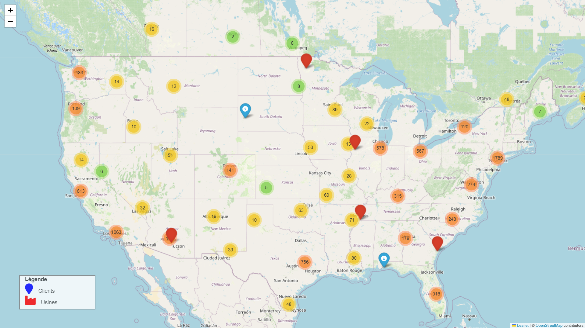
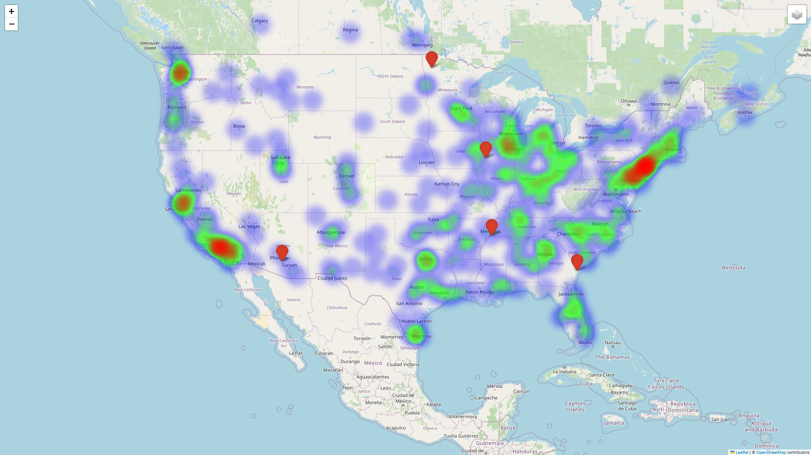
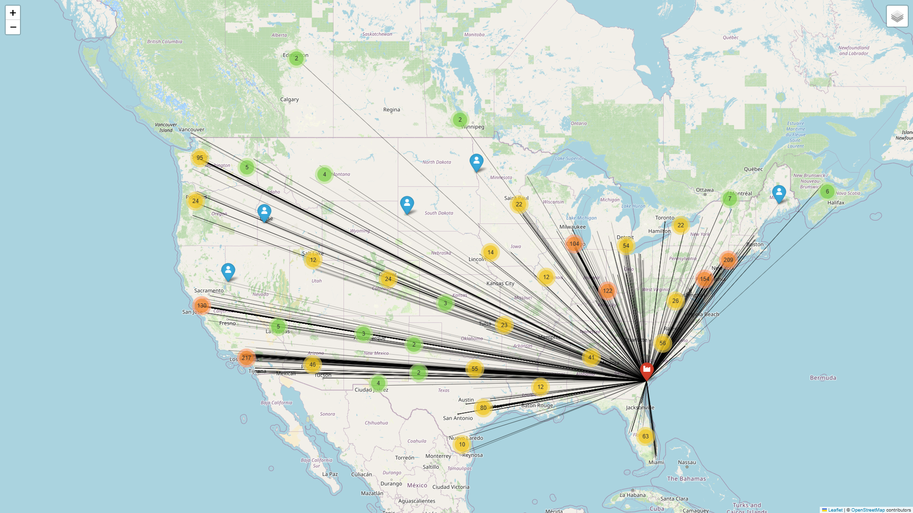
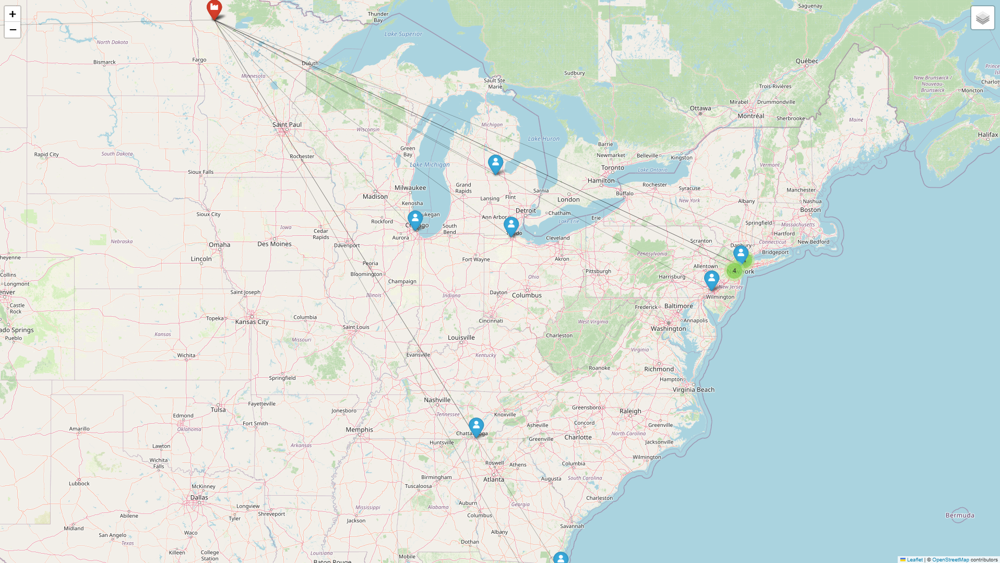
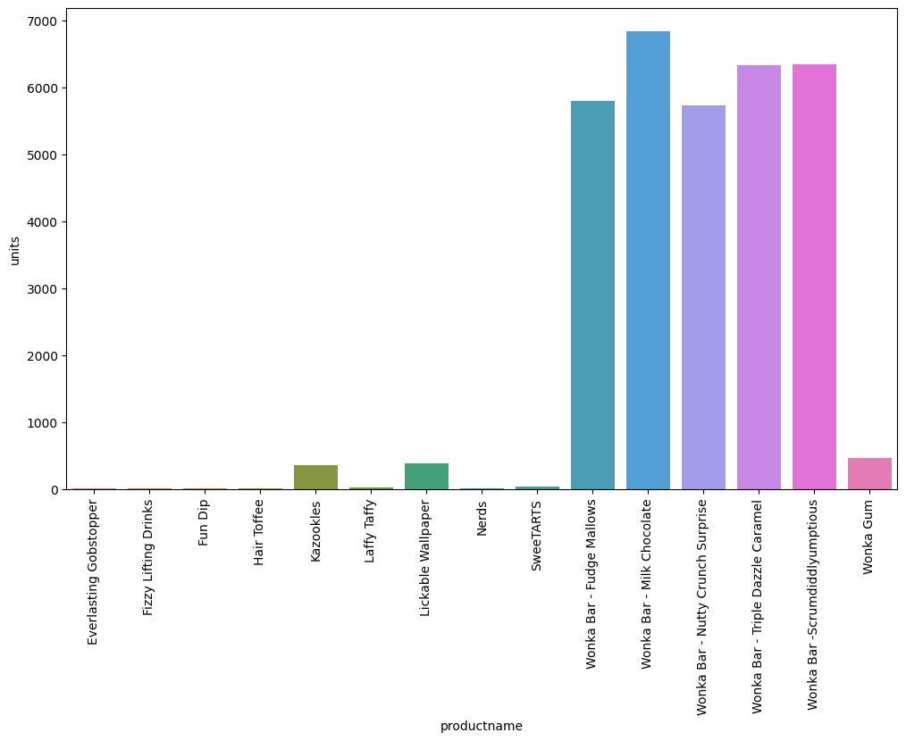
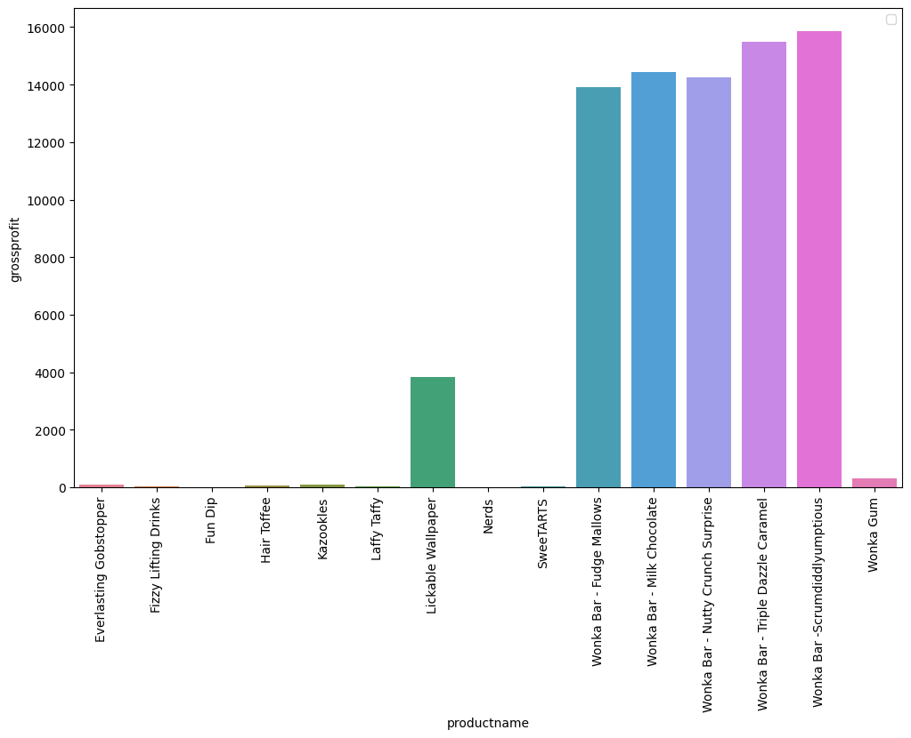
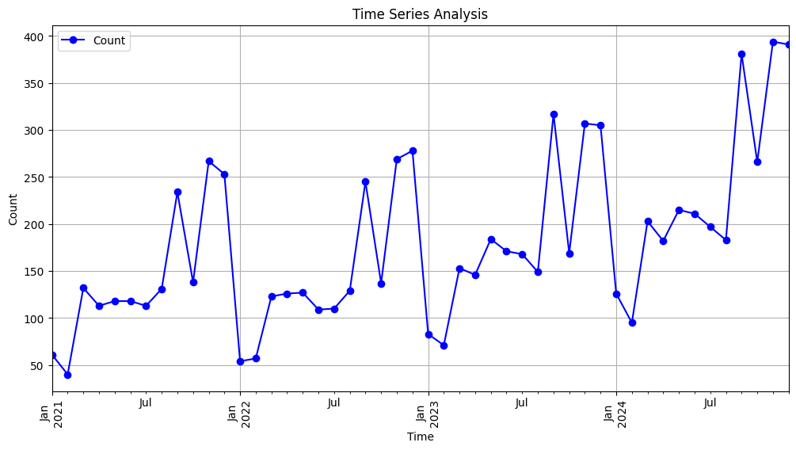
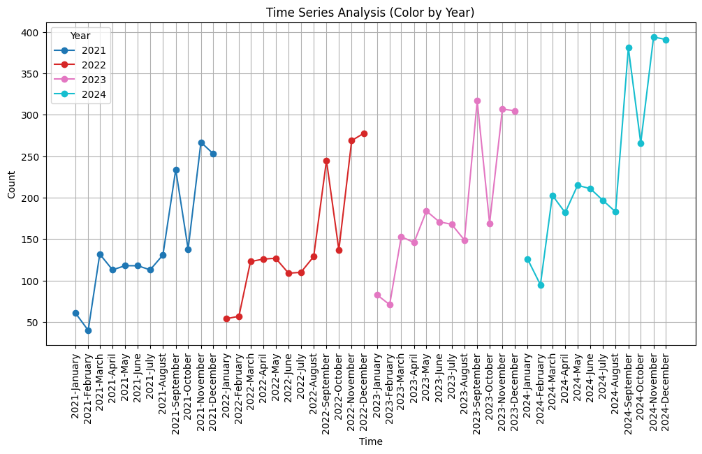

## A Propos du projet

Il s'agit d'un projet d'analyse commerciale basé sur une base de données proposée par Marven : 

### Description de la base de données : 
**Distributeur de bonbons aux États-Unis**  
Données de ventes et d'expédition géospatiales entre les usines et les clients pour un distributeur national de bonbons aux États-Unis. Cela inclut des informations sur les emplacements des clients et des usines, les commandes de vente et les objectifs, ainsi que les détails des produits.  

**Analyses recommandées**  
1. Quelles sont les routes d'expédition les plus efficaces entre les usines et les clients ?  
2. Quelles sont les routes les moins efficaces ?  
3. Quels segments de produits offrent les meilleures marges bénéficiaires ?  
4. Quels segments de produits devraient être transférés à une autre usine pour optimiser les itinéraires d'expédition ?  

**Vous souhaitez un retour sur vos solutions ?**  
Partagez vos visualisations (et, le cas échéant, vos tableaux croisés dynamiques, votre code, etc.) sur LinkedIn en mentionnant **@Maven Analytics**. Nous serons ravis de voir votre travail et de vous donner notre avis !

Voici les descriptions en français :

| Table      | Champ             | Description                                                                                 |
|------------|--------------------|---------------------------------------------------------------------------------------------|
| Sales      | Row ID            | Identifiant unique de ligne                                                                 |
| Sales      | Order ID          | Identifiant unique de commande                                                              |
| Sales      | Order Date        | Date de la commande                                                                         |
| Sales      | Ship Date         | Date d'expédition                                                                           |
| Sales      | Ship Mode         | Méthode d'expédition de la commande                                                         |
| Sales      | Customer ID       | Identifiant unique du client                                                                |
| Sales      | Country/Region    | Pays ou région du client                                                                    |
| Sales      | City              | Ville du client                                                                             |
| Sales      | State/Province    | État/province du client                                                                     |
| Sales      | Postal Code       | Code postal / code ZIP du client                                                            |
| Sales      | Division          | Division du produit                                                                         |
| Sales      | Region            | Région du client                                                                            |
| Sales      | Product ID        | Identifiant unique du produit                                                               |
| Sales      | Product Name      | Nom complet du produit                                                                      |
| Sales      | Sales             | Valeur totale des ventes de la commande                                                     |
| Sales      | Units             | Nombre total d'unités de la commande                                                        |
| Sales      | Gross Profit      | Bénéfice brut de la commande (Ventes - Coût)                                                |
| Sales      | Cost              | Coût de fabrication                                                                         |
| Factories  | Factory           | Nom de l'usine                                                                              |
| Factories  | Latitude          | Coordonnées de latitude                                                                     |
| Factories  | Longitude         | Coordonnées de longitude                                                                    |
| Products   | Division          | Division du produit                                                                         |
| Products   | Product Name      | Nom descriptif du produit                                                                   |
| Products   | Factory           | Nom de l'usine                                                                              |
| Products   | Product ID        | Identifiant unique du produit                                                               |
| Products   | Unit Price        | Prix de vente du produit                                                                    |
| Products   | Unit Cost         | Coût de production du produit                                                               |
| Targets    | Division          | Division du produit                                                                         |
| Targets    | Target            | Objectif de ventes 2024                                                                     |
| US Zips    | zip               | Le code postal à 5 chiffres attribué par le service postal des États-Unis                   |
| US Zips    | lat               | Latitude du code postal (en savoir plus)                                                    |
| US Zips    | lng               | Longitude du code postal (en savoir plus)                                                   |
| US Zips    | city              | Nom officiel de la ville selon l'USPS                                                      |
| US Zips    | state_id          | Abréviation officielle de l'État selon l'USPS                                               |
| US Zips    | state_name        | Nom de l'État                                                                               |
| US Zips    | zcta              | TRUE si le code postal est une zone de tabulation des codes postaux (en savoir plus)       |
| US Zips    | parent_zcta       | ZCTA qui contient ce code postal. Existe uniquement si zcta est FALSE, utile pour inférer des informations d'un code postal situé dans un ZCTA. |
| US Zips    | population        | Estimation de la population du code postal. Existe uniquement si zcta est TRUE             |
| US Zips    | density           | Densité de population estimée par kilomètre carré. Existe uniquement si zcta est TRUE      |
| US Zips    | county_fips       | Comté principal du code postal au format FIPS                                              |
| US Zips    | county_name       | Nom du comté (county_fips)                                                                 |
| US Zips    | county_weights    | Dictionnaire JSON listant tous les county_fips et leurs poids (par zone) associés au code postal |
| US Zips    | imprecise         | TRUE si la latitude/longitude a été géolocalisée en utilisant la ville (rare)               |
| US Zips    | military          | TRUE si le code postal est utilisé par l'armée américaine (latitude/longitude non disponible) |
| US Zips    | timezone          | Fuseau horaire de la ville au format de la base de données tz (ex. America/Los_Angeles)    |

## Data exploring & cleaning 
En explorant les données fournies, nous avons remarqué que les bases de données étaient un peu dispersées. Il a donc été nécessaire d'effectuer un travail de nettoyage et de reconstruction pour obtenir une nouvelle base de données propre et prête pour notre analyse.  

### Cleaning
- **Correspondance des "zip" de la base "uszips.csv" avec la colonne "Postal Code" de la base "Candy_Sales.csv"** : Cette étape nous a permis d’obtenir la longitude et la latitude de tous les points de livraison associés aux commandes.  

- **Remplacement des données manquantes** : La base "uszips" contient uniquement les adresses des clients situés aux États-Unis. Cependant, nous avons identifié des commandes provenant du Canada. Nous avons donc demandé à une intelligence artificielle de nous aider à retrouver les longitudes et latitudes correspondant aux adresses des clients situés au Canada. 

- **Création d'une colonne "distance"** : Cette colonne représente la distance entre chaque client et l'usine d'approvisionnement.  

---

### **Exploration**

#### **map.html**
Représentation des clients sur une carte.  
Cette visualisation permet d’identifier facilement l'emplacement des clients.  

---

#### **heatmap.html**
Ce graphique montre la densité des clients sur la carte.  
Les zones plus intenses indiquent une concentration plus élevée de clients.  

---

### **route.html**  
Ce graphique trace une ligne reliant chaque usine à ses clients.  
Cela permet de visualiser la distance entre les usines et leurs clients, offrant une vue claire pour l'analyse.  

Par exemple, ce graphique peut recommander la suppression de l’usine **"Sugar Shrack"**, qui n’a eu que **11 clients en 4 ans**, tout en étant située à de grandes distances de ses clients.  

---

Ce graphique est un **boxplot** qui compare la distribution des ventes (`Sales`) pour différentes catégories de produits représentées par les divisions (`Division`) : **Chocolate**, **Other**, et **Sugar**.

### Ce que montre ce graphique :

   - **Chocolate :**  
     Les ventes sont concentrées autour d'une plage étroite avec une médiane basse et quelques valeurs atypiques.  
     Cela indique que les ventes de produits au chocolat sont relativement faibles et homogènes.  
   - **Other :**  
     Cette catégorie a une plage beaucoup plus large, avec de nombreuses ventes élevées (outliers) et une médiane supérieure à celle de "Chocolate".  
     Cela indique une plus grande variabilité dans les ventes pour cette catégorie.  
   - **Sugar :**  
     Les ventes de produits sucrés sont très faibles, avec une médiane proche de zéro et peu de variabilité. Il y a cependant quelques outliers.  
     Cela suggère une faible performance des produits de cette catégorie.

---

## 1- Optimisation des Routes d’Exp ́edition

D'après nos analyses, les coûts d'expédition n'affectent pas la rentabilité de **US Candy**. En effet, quel que soit la distance du client, le nombre de commandes ou le type de produit, le profit reste inchangé. Cela pourrait s'expliquer par le fait que :

1. **La livraison des produits a peut-être été confiée à une autre entreprise**, et les frais de livraison sont donc facturés séparément du prix de vente.  
2. **Les coûts d'expédition sont directement inclus dans le coût d'achat**, ce qui les rend invisibles dans l'analyse des marges.

Cependant, quel que soit le cas de figure, une usine plus proche des clients entraînerait automatiquement :

- **Une réduction des frais de livraison**, ce qui pourrait rendre les produits encore plus compétitifs.  
- **Une réception plus rapide des produits par les clients**, améliorant ainsi leur satisfaction.  

Ces avantages bénéficient autant à **US Candy** qu'à ses clients, renforçant la relation commerciale et la compétitivité de l’entreprise.

**La suite de notre analyse se concentrera donc davantage sur comment rapprocher les usines des clients, plutôt que sur l'optimisation des trajets de livraison.**

## 2- Analyse des Marges par Produit ; 

**Nombre total de commande par produit**

<table border="1" class="dataframe">
  <thead>
    <tr style="text-align: right;">
      <th></th>
      <th>productname</th>
      <th>count</th>
    </tr>
  </thead>
  <tbody>
    <tr>
      <th>0</th>
      <td>Wonka Bar - Milk Chocolate</td>
      <td>1768</td>
    </tr>
    <tr>
      <th>1</th>
      <td>Wonka Bar -Scrumdiddlyumptious</td>
      <td>1704</td>
    </tr>
    <tr>
      <th>2</th>
      <td>Wonka Bar - Triple Dazzle Caramel</td>
      <td>1677</td>
    </tr>
    <tr>
      <th>3</th>
      <td>Wonka Bar - Nutty Crunch Surprise</td>
      <td>1529</td>
    </tr>
    <tr>
      <th>4</th>
      <td>Wonka Bar - Fudge Mallows</td>
      <td>1527</td>
    </tr>
    <tr>
      <th>5</th>
      <td>Wonka Gum</td>
      <td>118</td>
    </tr>
    <tr>
      <th>6</th>
      <td>Kazookles</td>
      <td>94</td>
    </tr>
    <tr>
      <th>7</th>
      <td>Lickable Wallpaper</td>
      <td>92</td>
    </tr>
    <tr>
      <th>8</th>
      <td>Laffy Taffy</td>
      <td>10</td>
    </tr>
    <tr>
      <th>9</th>
      <td>SweeTARTS</td>
      <td>10</td>
    </tr>
    <tr>
      <th>10</th>
      <td>Fizzy Lifting Drinks</td>
      <td>6</td>
    </tr>
    <tr>
      <th>11</th>
      <td>Hair Toffee</td>
      <td>4</td>
    </tr>
    <tr>
      <th>12</th>
      <td>Nerds</td>
      <td>4</td>
    </tr>
    <tr>
      <th>13</th>
      <td>Everlasting Gobstopper</td>
      <td>3</td>
    </tr>
    <tr>
      <th>14</th>
      <td>Fun Dip</td>
      <td>3</td>
    </tr>
  </tbody>
</table>

---

<table border="1" class="dataframe">
  <thead>
    <tr style="text-align: right;">
      <th></th>
      <th>grossprofit</th>
    </tr>
    <tr>
      <th>productname</th>
      <th></th>
    </tr>
  </thead>
  <tbody>
    <tr>
      <th>Everlasting Gobstopper</th>
      <td>104.00</td>
    </tr>
    <tr>
      <th>Fizzy Lifting Drinks</th>
      <td>47.25</td>
    </tr>
    <tr>
      <th>Fun Dip</th>
      <td>4.80</td>
    </tr>
    <tr>
      <th>Hair Toffee</th>
      <td>59.50</td>
    </tr>
    <tr>
      <th>Kazookles</th>
      <td>91.50</td>
    </tr>
    <tr>
      <th>Laffy Taffy</th>
      <td>33.48</td>
    </tr>
    <tr>
      <th>Lickable Wallpaper</th>
      <td>3830.00</td>
    </tr>
    <tr>
      <th>Nerds</th>
      <td>7.00</td>
    </tr>
    <tr>
      <th>SweeTARTS</th>
      <td>28.70</td>
    </tr>
    <tr>
      <th>Wonka Bar - Fudge Mallows</th>
      <td>13903.20</td>
    </tr>
    <tr>
      <th>Wonka Bar - Milk Chocolate</th>
      <td>14426.07</td>
    </tr>
    <tr>
      <th>Wonka Bar - Nutty Crunch Surprise</th>
      <td>14250.27</td>
    </tr>
    <tr>
      <th>Wonka Bar - Triple Dazzle Caramel</th>
      <td>15501.15</td>
    </tr>
    <tr>
      <th>Wonka Bar -Scrumdiddlyumptious</th>
      <td>15867.50</td>
    </tr>
    <tr>
      <th>Wonka Gum</th>
      <td>303.55</td>
    </tr>
  </tbody>
</table>

**Profit total réaliser pour chaque produit au cours des 4ans**

### Les plus rentables

Les analyses révèlent que les produits les plus rentables pour l'entreprise sont ceux de la division chocolat. En effet, cette catégorie se distingue par des performances exceptionnelles, tant en termes de volume de ventes que de rentabilité. 

* Le produit phare de l'entreprise est le **Wonka Bar - Milk Chocolate**, avec un total de 1 768 commandes. Ce produit se distingue par son succès auprès des consommateurs, surpassant largement ses concurrents directs dans la même catégorie. Parmi ces derniers, on trouve :

  - **Wonka Bar - Scrumdiddlyumptious** avec 1 704 commandes,
  - **Wonka Bar - Triple Dazzle Caramel** avec 1 677 commandes,
  - **Wonka Bar - Nutty Crunch Surprise** avec 1 529 commandes.

Ces produits, bien que légèrement moins populaires que le **Wonka Bar - Milk Chocolate**, restent des incontournables de la gamme, contribuant de manière significative au chiffre d'affaires de la division chocolat.

* En termes de rentabilité, les produits chocolatés se révèlent être les plus profitables pour l'entreprise **US Candy**. En particulier, le **Wonka Bar - Scrumdiddlyumptious** a généré un chiffre d'affaires impressionnant de **15 867,50 dollars** au cours des quatre dernières années. Cela montre que, bien que ce produit soit moins vendu que le **Wonka Bar - Milk Chocolate**, sa rentabilité est nettement plus élevée, ce qui en fait un atout stratégique pour l'entreprise. 

En somme, la division chocolat représente non seulement un fort volume de ventes mais aussi une rentabilité exceptionnelle pour l'entreprise, illustrée par le succès financier de ses produits phares, notamment le **Wonka Bar - Scrumdiddlyumptious**.

### Les moins rentables

Après avoir analysé les produits les plus rentables, nous nous penchons sur les produits les moins performants. Cette catégorie est principalement représentée par les divisions **Sugar** et **Other**, qui se distinguent par leurs faibles volumes de vente et leur rentabilité limitée.

- **Division Sugar** : Les produits de cette division affichent des chiffres de vente très faibles, avec souvent moins de 8 commandes sur l'ensemble des 4 années analysées. Par exemple :
  - **Everlasting Gobstopper** : seulement **3 commandes**,
  - **Fun Dip** : également limité à **3 commandes**.

Ces chiffres témoignent d'un faible attrait pour ces produits, suggérant qu'ils peinent à trouver leur place sur le marché.

- **Division Other** : Bien que moins documentée dans cette analyse, cette division semble également souffrir d'un manque d'intérêt de la part des consommateurs, contribuant peu à la rentabilité globale de l'entreprise.

## Etude de la saisonnalité: 

**Tableau du nombre total de commandes par mois**

<table border="1" class="dataframe">
  <thead>
    <tr style="text-align: right;">
      <th>month_name</th>
      <th>January</th>
      <th>February</th>
      <th>March</th>
      <th>April</th>
      <th>May</th>
      <th>June</th>
      <th>July</th>
      <th>August</th>
      <th>September</th>
      <th>October</th>
      <th>November</th>
      <th>December</th>
    </tr>
    <tr>
      <th>orderyear</th>
      <th></th>
      <th></th>
      <th></th>
      <th></th>
      <th></th>
      <th></th>
      <th></th>
      <th></th>
      <th></th>
      <th></th>
      <th></th>
      <th></th>
    </tr>
  </thead>
  <tbody>
    <tr>
      <th>2021</th>
      <td>61</td>
      <td>40</td>
      <td>132</td>
      <td>113</td>
      <td>118</td>
      <td>118</td>
      <td>113</td>
      <td>131</td>
      <td>234</td>
      <td>138</td>
      <td>267</td>
      <td>253</td>
    </tr>
    <tr>
      <th>2022</th>
      <td>54</td>
      <td>57</td>
      <td>123</td>
      <td>126</td>
      <td>127</td>
      <td>109</td>
      <td>110</td>
      <td>129</td>
      <td>245</td>
      <td>137</td>
      <td>269</td>
      <td>278</td>
    </tr>
    <tr>
      <th>2023</th>
      <td>83</td>
      <td>71</td>
      <td>153</td>
      <td>146</td>
      <td>184</td>
      <td>171</td>
      <td>168</td>
      <td>149</td>
      <td>317</td>
      <td>169</td>
      <td>307</td>
      <td>305</td>
    </tr>
    <tr>
      <th>2024</th>
      <td>126</td>
      <td>95</td>
      <td>203</td>
      <td>182</td>
      <td>215</td>
      <td>211</td>
      <td>197</td>
      <td>183</td>
      <td>381</td>
      <td>266</td>
      <td>394</td>
      <td>391</td>
    </tr>
  </tbody>
</table>

**Courbe de saisonnalité**
---
Avec les deux courbes de saisonnalité ci-dessous, nous observons une répétition presque parfaite des schémas au fil des années, ce qui indique une forte composante saisonnière dans les données.

En résumé, nous remarquons que **US Candy** réalise ses plus grosses ventes à partir du troisième mois de l'année (mars). Le deuxième plus grand pic de ventes est observé en septembre, ce qui pourrait correspondre au début des vacances. Enfin, des hausses significatives sont également enregistrées en octobre, novembre et décembre, avant une chute marquée dès le mois de janvier de l'année suivante.

Cependant, une forte baisse en octobre, visible sous la forme d’un creux entre les pics de septembre et novembre au cours des quatre années étudiées, suscite des interrogations. Voici quelques pistes de réflexion :  
- **Pourquoi observe-t-on un pic important des ventes en mars ?** Est-ce lié à un événement spécifique, une fête ou une campagne publicitaire ?  
- **Quelles sont les raisons du pic de septembre ?** S'agit-il de promotions ciblées, de changements dans la demande des consommateurs, ou d'une préparation aux fêtes de fin d'année ?  
- **Pourquoi observe-t-on une chute marquée en octobre ?** Cette baisse est-elle liée à une concurrence accrue, à une saturation du marché ou à un manque de campagnes marketing ?  
- **Quels facteurs expliquent les ventes importantes en fin d'année (novembre-décembre) ?** Cela pourrait-il être renforcé par des promotions ou des offres spéciales ?  

### Recommandations Marketing
1. **Analyser les données clients :** Mener des enquêtes pour identifier les raisons derrière les pics (mars, septembre, décembre) et les chutes (octobre, janvier). Comprendre les attentes des consommateurs lors de ces périodes.  
2. **Renforcer la stratégie marketing en octobre :** Mettre en place des campagnes promotionnelles pour combler le creux entre septembre et novembre, par exemple en lançant des produits ou des offres spéciales pour Halloween.  
3. **Optimiser les ventes en mars et en septembre :** Identifier les produits les plus populaires lors de ces périodes et renforcer leur visibilité grâce à des promotions ciblées ou à une communication plus agressive.  
4. **Prolonger l’effet des ventes de fin d’année :** Maintenir l'intérêt des consommateurs en janvier avec des soldes, des campagnes de fidélisation ou des offres sur les produits invendus.  
5. **Exploration de nouveaux marchés :** Si certaines périodes restent faibles malgré les efforts, envisager de diversifier les produits ou de cibler de nouveaux segments de clientèle.  

En combinant une analyse approfondie des données et une stratégie marketing proactive, **US Candy** pourrait maximiser ses opportunités tout au long de l'année et limiter les fluctuations saisonnières.  

### Analyse des règles d'association pour suggérer des produits et accroître les ventes.

<table border="1" class="dataframe">
  <thead>
    <tr style="text-align: right;">
      <th></th>
      <th>antecedents</th>
      <th>consequents</th>
      <th>antecedent support</th>
      <th>consequent support</th>
    </tr>
  </thead>
  <tbody>
    <tr>
      <th>0</th>
      <td>(Wonka Bar - Fudge Mallows, Wonka Bar - Milk C...</td>
      <td>(Wonka Bar - Triple Dazzle Caramel)</td>
      <td>0.091594</td>
      <td>0.328311</td>
    </tr>
    <tr>
      <th>1</th>
      <td>(Wonka Bar - Fudge Mallows, Wonka Bar - Triple...</td>
      <td>(Wonka Bar - Milk Chocolate)</td>
      <td>0.080690</td>
      <td>0.345956</td>
    </tr>
    <tr>
      <th>2</th>
      <td>(Wonka Bar - Milk Chocolate, Wonka Bar - Tripl...</td>
      <td>(Wonka Bar - Fudge Mallows)</td>
      <td>0.093577</td>
      <td>0.297383</td>
    </tr>
    <tr>
      <th>3</th>
      <td>(Wonka Bar - Fudge Mallows)</td>
      <td>(Wonka Bar - Milk Chocolate, Wonka Bar - Tripl...</td>
      <td>0.297383</td>
      <td>0.093577</td>
    </tr>
  </tbody>
</table>

Les valeurs décrivent des associations entre des produits vendus par **US Candy**, en mesurant la force des relations entre eux. Chaque ligne représente une règle d'association, avec des produits dans les colonnes **antecedents** (prémisses) et **consequents** (conséquences). Voici une analyse des principales métriques :  

1. **Confiance (confidence)** : La probabilité qu’un client achète les produits "conséquents" s’il a déjà acheté les "antécédents". Par exemple, dans la première règle, si un client achète les produits "Wonka Bar - Fudge Mallows" et "Milk Chocolate", il y a une probabilité de 35,06 % qu'il achète également "Triple Dazzle Caramel". Une forte confiance indique une forte association.  

2. **Lift** : Indique à quel point l'achat des "antécédents" augmente la probabilité d'achat des "conséquents". Une valeur supérieure à 1, comme dans les règles analysées (1.068 à 1.154), montre que les associations sont bénéfiques et que les produits se complètent bien.  

3. **Support** : Reflète la fréquence de la co-occurrence des produits dans l'ensemble des transactions. Les faibles supports (par exemple, 0.032 dans toutes les règles) suggèrent que ces associations concernent une niche de clients.  

4. **Conviction** et **Zhang’s Metric** : Mesurent la robustesse et la fiabilité des règles. Des valeurs élevées (exemple : conviction à 1.034-1.086) confirment des associations modérément solides.  

5. **Jaccard et Certainty** : Indiquent la similarité et la certitude de l'association entre les produits. Ici, les valeurs restent moyennes, suggérant des corrélations intéressantes, mais pas extrêmement fortes.  

### Recommandations pour augmenter les ventes :  

Voici les règles simples et directes basées sur les associations :

1. **Si une personne achète "Wonka Bar - Fudge Mallows" et "Milk Chocolate"**, suggérer **"Wonka Bar - Triple Dazzle Caramel"**.  
2. **Si une personne achète "Wonka Bar - Fudge Mallows" et "Triple Dazzle Caramel"**, suggérer **"Wonka Bar - Milk Chocolate"**.  
3. **Si une personne achète "Wonka Bar - Milk Chocolate" et "Triple Dazzle Caramel"**, suggérer **"Wonka Bar - Fudge Mallows"**.  
4. **Si une personne achète seulement "Wonka Bar - Fudge Mallows"**, suggérer **"Milk Chocolate" et "Triple Dazzle Caramel"**. 
 

## Reommandations : 
---
**Études de marché** : Identifier les raisons derrière le faible intérêt pour ces produits. Cela peut inclure des enquêtes consommateurs pour comprendre leurs attentes et besoins, 

## Contribution:

