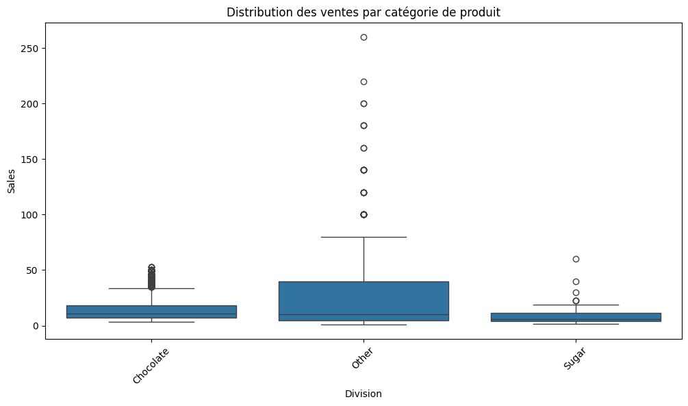

## About the Project  

This is a business analysis project based on a database provided by Marven:  
  
  

### Database Description:  
**U.S. Candy Distributor**  
Sales and geospatial shipping data between factories and customers for a national candy distributor in the United States. This includes information on customer and factory locations, sales orders and targets, as well as product details.  

**Recommended Analyses**  
1. What are the most efficient shipping routes between factories and customers?  
2. What are the least efficient routes?  
3. Which product segments offer the best profit margins?  
4. Which product segments should be transferred to another factory to optimize shipping routes?  

**Want feedback on your solutions?**  
Share your visualizations (and, if applicable, your pivot tables, code, etc.) on LinkedIn by tagging **@Maven Analytics**. We would love to see your work and provide our feedback!  

| Table      | Field             | Description                                                                                 |
|------------|------------------|---------------------------------------------------------------------------------------------|
| Sales      | Row ID           | Unique row identifier                                                                       |
| Sales      | Order ID         | Unique order identifier                                                                    |
| Sales      | Order Date       | Order date                                                                                |
| Sales      | Ship Date        | Shipping date                                                                             |
| Sales      | Ship Mode        | Order shipping method                                                                     |
| Sales      | Customer ID      | Unique customer identifier                                                                |
| Sales      | Country/Region   | Customer's country or region                                                              |
| Sales      | City             | Customer's city                                                                           |
| Sales      | State/Province   | Customer's state or province                                                             |
| Sales      | Postal Code      | Customer's ZIP or postal code                                                             |
| Sales      | Division         | Product division                                                                          |
| Sales      | Region           | Customer's region                                                                        |
| Sales      | Product ID       | Unique product identifier                                                                |
| Sales      | Product Name     | Full product name                                                                        |
| Sales      | Sales            | Total sales value of the order                                                           |
| Sales      | Units            | Total number of units in the order                                                       |
| Sales      | Gross Profit     | Gross profit of the order (Sales - Cost)                                                 |
| Sales      | Cost             | Manufacturing cost                                                                       |
| Factories  | Factory          | Factory name                                                                            |
| Factories  | Latitude         | Latitude coordinates                                                                    |
| Factories  | Longitude        | Longitude coordinates                                                                   |
| Products   | Division         | Product division                                                                        |
| Products   | Product Name     | Product descriptive name                                                                |
| Products   | Factory          | Factory name                                                                           |
| Products   | Product ID       | Unique product identifier                                                              |
| Products   | Unit Price       | Product selling price                                                                  |
| Products   | Unit Cost        | Product production cost                                                                |
| Targets    | Division         | Product division                                                                       |
| Targets    | Target           | 2024 sales target                                                                      |
| US Zips    | zip              | 5-digit ZIP code assigned by the United States Postal Service                          |
| US Zips    | lat              | ZIP code latitude (learn more)                                                         |
| US Zips    | lng              | ZIP code longitude (learn more)                                                        |
| US Zips    | city             | Official city name according to USPS                                                  |
| US Zips    | state_id         | Official USPS state abbreviation                                                      |
| US Zips    | state_name       | State name                                                                            |
| US Zips    | zcta             | TRUE if the ZIP code is a ZIP Code Tabulation Area (learn more)                      |
| US Zips    | parent_zcta      | ZCTA containing this ZIP code. Exists only if zcta is FALSE, useful for inferring data from a ZIP code within a ZCTA. |
| US Zips    | population       | Estimated population for the ZIP code. Exists only if zcta is TRUE                    |
| US Zips    | density          | Estimated population density per square kilometer. Exists only if zcta is TRUE       |
| US Zips    | county_fips      | Primary county of the ZIP code in FIPS format                                         |
| US Zips    | county_name      | County name (county_fips)                                                             |
| US Zips    | county_weights   | JSON dictionary listing all county_fips and their respective weights for the ZIP code |
| US Zips    | imprecise        | TRUE if latitude/longitude was geolocated using the city (rare)                      |
| US Zips    | military         | TRUE if the ZIP code is used by the U.S. military (latitude/longitude not available)  |
| US Zips    | timezone         | City’s timezone in tz database format (e.g., America/Los_Angeles)                     |

## Data Exploring & Cleaning  
While exploring the provided data, we noticed that the databases were somewhat scattered. It was therefore necessary to perform a cleaning and reconstruction process to obtain a clean and structured database ready for our analysis.  

### Cleaning  
- **Matching the "zip" column from the "uszips.csv" database with the "Postal Code" column from the "Candy_Sales.csv" database**: This step allowed us to obtain the longitude and latitude of all delivery points associated with the orders.  

- **Replacing missing data**: The "uszips" database only contains addresses of customers located in the United States. However, we identified orders coming from Canada. We then used artificial intelligence to help retrieve the corresponding longitude and latitude for customer addresses in Canada.  

- **Creating a "distance" column**: This column represents the distance between each customer and the supplying factory.  

### **Exploration**  

#### **map.html**  
Representation of customers on a map.  
This visualization makes it easy to identify customer locations.  

  

---  

#### **heatmap.html**  
This map shows customer density.  
More intense areas indicate a higher concentration of customers.  

  

---  

### **route.html**  
This map draws a line connecting each factory to its customers.  
It provides a clear view of the distance between factories and their customers, aiding analysis.  

  

For example, this visualization can suggest shutting down the **"Sugar Shrack"** factory, which only had **11 customers in 4 years**, while being located far from them.  

  

---  

This map is a **boxplot** comparing the sales distribution (`Sales`) across different product categories represented by divisions (`Division`): **Chocolate**, **Other**, and **Sugar**.  

  

### Insights from this chart:  

- **Chocolate:**  
  Sales are concentrated within a narrow range, with a low median and a few outliers.  
  This suggests that chocolate product sales are relatively low and consistent.  

- **Other:**  
  This category has a much wider range, with many high sales outliers and a median higher than "Chocolate."  
  This indicates greater variability in sales for this category.  

- **Sugar:**  
  Sales of sugar products are very low, with a median close to zero and little variability. However, there are a few outliers.  
  This suggests poor performance in this category.  

---  

## 1- Optimization of Shipping Routes  

Based on our analysis, shipping costs do not impact **US Candy**'s profitability. Regardless of customer distance, order volume, or product type, profits remain unchanged. This could be explained by:  

1. **Product delivery might be outsourced to another company,** meaning shipping fees are charged separately from the sales price.  
2. **Shipping costs are directly included in the purchase cost,** making them invisible in the margin analysis.  

However, in any scenario, having a factory closer to customers would automatically result in:  

- **Lower delivery costs,** making products even more competitive.  
- **Faster product reception by customers,** improving customer satisfaction.  

These advantages benefit both **US Candy** and its customers, strengthening business relationships and enhancing the company's competitiveness.  

**The next phase of our analysis will focus on how to bring factories closer to customers rather than optimizing delivery routes.**  

## 2- Analyse des Marges par Produit ; 

**Total number of order**

<table border="1" class="dataframe">
  <thead>
    <tr style="text-align: right;">
      <th></th>
      <th>productname</th>
      <th>count</th>
    </tr>
  </thead>
  <tbody>
    <tr>
      <th>0</th>
      <td>Wonka Bar - Milk Chocolate</td>
      <td>1768</td>
    </tr>
    <tr>
      <th>1</th>
      <td>Wonka Bar -Scrumdiddlyumptious</td>
      <td>1704</td>
    </tr>
    <tr>
      <th>2</th>
      <td>Wonka Bar - Triple Dazzle Caramel</td>
      <td>1677</td>
    </tr>
    <tr>
      <th>3</th>
      <td>Wonka Bar - Nutty Crunch Surprise</td>
      <td>1529</td>
    </tr>
    <tr>
      <th>4</th>
      <td>Wonka Bar - Fudge Mallows</td>
      <td>1527</td>
    </tr>
    <tr>
      <th>5</th>
      <td>Wonka Gum</td>
      <td>118</td>
    </tr>
    <tr>
      <th>6</th>
      <td>Kazookles</td>
      <td>94</td>
    </tr>
    <tr>
      <th>7</th>
      <td>Lickable Wallpaper</td>
      <td>92</td>
    </tr>
    <tr>
      <th>8</th>
      <td>Laffy Taffy</td>
      <td>10</td>
    </tr>
    <tr>
      <th>9</th>
      <td>SweeTARTS</td>
      <td>10</td>
    </tr>
    <tr>
      <th>10</th>
      <td>Fizzy Lifting Drinks</td>
      <td>6</td>
    </tr>
    <tr>
      <th>11</th>
      <td>Hair Toffee</td>
      <td>4</td>
    </tr>
    <tr>
      <th>12</th>
      <td>Nerds</td>
      <td>4</td>
    </tr>
    <tr>
      <th>13</th>
      <td>Everlasting Gobstopper</td>
      <td>3</td>
    </tr>
    <tr>
      <th>14</th>
      <td>Fun Dip</td>
      <td>3</td>
    </tr>
  </tbody>
</table>

---

</style>
<table border="1" class="dataframe">
  <thead>
    <tr style="text-align: right;">
      <th></th>
      <th>grossprofit</th>
    </tr>
    <tr>
      <th>productname</th>
      <th></th>
    </tr>
  </thead>
  <tbody>
    <tr>
      <th>Everlasting Gobstopper</th>
      <td>104.00</td>
    </tr>
    <tr>
      <th>Fizzy Lifting Drinks</th>
      <td>47.25</td>
    </tr>
    <tr>
      <th>Fun Dip</th>
      <td>4.80</td>
    </tr>
    <tr>
      <th>Hair Toffee</th>
      <td>59.50</td>
    </tr>
    <tr>
      <th>Kazookles</th>
      <td>91.50</td>
    </tr>
    <tr>
      <th>Laffy Taffy</th>
      <td>33.48</td>
    </tr>
    <tr>
      <th>Lickable Wallpaper</th>
      <td>3830.00</td>
    </tr>
    <tr>
      <th>Nerds</th>
      <td>7.00</td>
    </tr>
    <tr>
      <th>SweeTARTS</th>
      <td>28.70</td>
    </tr>
    <tr>
      <th>Wonka Bar - Fudge Mallows</th>
      <td>13903.20</td>
    </tr>
    <tr>
      <th>Wonka Bar - Milk Chocolate</th>
      <td>14426.07</td>
    </tr>
    <tr>
      <th>Wonka Bar - Nutty Crunch Surprise</th>
      <td>14250.27</td>
    </tr>
    <tr>
      <th>Wonka Bar - Triple Dazzle Caramel</th>
      <td>15501.15</td>
    </tr>
    <tr>
      <th>Wonka Bar -Scrumdiddlyumptious</th>
      <td>15867.50</td>
    </tr>
    <tr>
      <th>Wonka Gum</th>
      <td>303.55</td>
    </tr>
  </tbody>
</table>

**Total Profit Generated for Each Product Over 4 Years**  
  

---  

### Most Profitable Products  

Analysis reveals that the most profitable products for the company belong to the chocolate division. This category stands out due to its exceptional performance in both sales volume and profitability.  

* The company's flagship product is the **Wonka Bar - Milk Chocolate**, with a total of 1,768 orders. This product has achieved remarkable consumer success, far surpassing its direct competitors in the same category. These include:  

  - **Wonka Bar - Scrumdiddlyumptious** with 1,704 orders,  
  - **Wonka Bar - Triple Dazzle Caramel** with 1,677 orders,  
  - **Wonka Bar - Nutty Crunch Surprise** with 1,529 orders.  

Although slightly less popular than the **Wonka Bar - Milk Chocolate**, these products remain key items in the lineup, contributing significantly to the chocolate division’s revenue.  

* In terms of profitability, chocolate products prove to be the most lucrative for **US Candy**. Notably, **Wonka Bar - Scrumdiddlyumptious** generated an impressive **$15,867.50** in revenue over the past four years. This indicates that, despite being sold less than **Wonka Bar - Milk Chocolate**, its profitability is significantly higher, making it a strategic asset for the company.  

In summary, the chocolate division represents not only a high sales volume but also exceptional profitability for the company, as illustrated by the financial success of its flagship products, particularly the **Wonka Bar - Scrumdiddlyumptious**.  

---  

### Least Profitable Products  

After analyzing the most profitable products, we turn to those with the weakest performance. This category is primarily represented by the **Sugar** and **Other** divisions, which show low sales volumes and limited profitability.  

- **Sugar Division:** Products in this division exhibit very low sales numbers, with often fewer than 8 orders over the four years analyzed. For example:  
  - **Everlasting Gobstopper**: only **3 orders**,  
  - **Fun Dip**: also limited to **3 orders**.  

These figures suggest a lack of consumer interest, indicating that these products struggle to find their place in the market.  

- **Other Division:** While less documented in this analysis, this division also appears to suffer from low consumer demand, contributing little to the company's overall profitability.  

---  

## Seasonality Analysis  

**Table of Total Orders per Month**  

</style>
<table border="1" class="dataframe">
  <thead>
    <tr style="text-align: right;">
      <th>month_name</th>
      <th>January</th>
      <th>February</th>
      <th>March</th>
      <th>April</th>
      <th>May</th>
      <th>June</th>
      <th>July</th>
      <th>August</th>
      <th>September</th>
      <th>October</th>
      <th>November</th>
      <th>December</th>
    </tr>
    <tr>
      <th>orderyear</th>
      <th></th>
      <th></th>
      <th></th>
      <th></th>
      <th></th>
      <th></th>
      <th></th>
      <th></th>
      <th></th>
      <th></th>
      <th></th>
      <th></th>
    </tr>
  </thead>
  <tbody>
    <tr>
      <th>2021</th>
      <td>61</td>
      <td>40</td>
      <td>132</td>
      <td>113</td>
      <td>118</td>
      <td>118</td>
      <td>113</td>
      <td>131</td>
      <td>234</td>
      <td>138</td>
      <td>267</td>
      <td>253</td>
    </tr>
    <tr>
      <th>2022</th>
      <td>54</td>
      <td>57</td>
      <td>123</td>
      <td>126</td>
      <td>127</td>
      <td>109</td>
      <td>110</td>
      <td>129</td>
      <td>245</td>
      <td>137</td>
      <td>269</td>
      <td>278</td>
    </tr>
    <tr>
      <th>2023</th>
      <td>83</td>
      <td>71</td>
      <td>153</td>
      <td>146</td>
      <td>184</td>
      <td>171</td>
      <td>168</td>
      <td>149</td>
      <td>317</td>
      <td>169</td>
      <td>307</td>
      <td>305</td>
    </tr>
    <tr>
      <th>2024</th>
      <td>126</td>
      <td>95</td>
      <td>203</td>
      <td>182</td>
      <td>215</td>
      <td>211</td>
      <td>197</td>
      <td>183</td>
      <td>381</td>
      <td>266</td>
      <td>394</td>
      <td>391</td>
    </tr>
  </tbody>
</table>

### **Seasonality Curve**  
---  
With the two seasonality curves below, we observe an almost perfect repetition of patterns over the years, indicating a strong seasonal component in the data.  

In summary, **US Candy** achieves its highest sales starting from the third month of the year (March). The second largest sales peak occurs in September, possibly corresponding to the start of the holiday season. Significant increases are also recorded in October, November, and December, followed by a sharp decline in January of the following year.  

However, a notable drop in October, visible as a dip between the September and November peaks over the four years studied, raises some questions. Here are a few points to consider:  
- **Why do we see a significant sales peak in March?** Is it related to a specific event, a holiday, or a marketing campaign?  
- **What are the reasons behind the September peak?** Could it be due to targeted promotions, shifts in consumer demand, or preparation for the holiday season?  
- **Why does a sharp decline occur in October?** Is this due to increased competition, market saturation, or a lack of marketing campaigns?  
- **What factors contribute to high sales at the end of the year (November-December)?** Could this be further enhanced through promotions or special offers?  

### **Marketing Recommendations**  
1. **Analyze customer data:** Conduct surveys to identify the reasons behind sales peaks (March, September, December) and declines (October, January). Understand consumer expectations during these periods.  
2. **Strengthen the marketing strategy in October:** Implement promotional campaigns to bridge the gap between September and November, for example, by launching special offers for Halloween.  
3. **Optimize sales in March and September:** Identify the most popular products during these periods and enhance their visibility through targeted promotions or aggressive communication.  
4. **Extend the impact of end-of-year sales:** Maintain consumer interest in January with discounts, loyalty campaigns, or promotions on unsold products.  
5. **Explore new markets:** If certain periods remain weak despite efforts, consider diversifying products or targeting new customer segments.  

By combining in-depth data analysis with a proactive marketing strategy, **US Candy** can maximize opportunities throughout the year and minimize seasonal fluctuations.  

### Association Rule Analysis to Suggest Products and Increase Sales.

</style>
<table border="1" class="dataframe">
  <thead>
    <tr style="text-align: right;">
      <th></th>
      <th>antecedents</th>
      <th>consequents</th>
      <th>antecedent support</th>
      <th>consequent support</th>
    </tr>
  </thead>
  <tbody>
    <tr>
      <th>0</th>
      <td>(Wonka Bar - Fudge Mallows, Wonka Bar - Milk C...</td>
      <td>(Wonka Bar - Triple Dazzle Caramel)</td>
      <td>0.091594</td>
      <td>0.328311</td>
    </tr>
    <tr>
      <th>1</th>
      <td>(Wonka Bar - Fudge Mallows, Wonka Bar - Triple...</td>
      <td>(Wonka Bar - Milk Chocolate)</td>
      <td>0.080690</td>
      <td>0.345956</td>
    </tr>
    <tr>
      <th>2</th>
      <td>(Wonka Bar - Milk Chocolate, Wonka Bar - Tripl...</td>
      <td>(Wonka Bar - Fudge Mallows)</td>
      <td>0.093577</td>
      <td>0.297383</td>
    </tr>
    <tr>
      <th>3</th>
      <td>(Wonka Bar - Fudge Mallows)</td>
      <td>(Wonka Bar - Milk Chocolate, Wonka Bar - Tripl...</td>
      <td>0.297383</td>
      <td>0.093577</td>
    </tr>
  </tbody>
</table>

### English Translation  

The values describe associations between products sold by **US Candy**, measuring the strength of relationships between them. Each row represents an association rule, with products in the **antecedents** (premises) and **consequents** (consequences) columns. Here is an analysis of the key metrics:  

1. **Confidence**: The probability that a customer will purchase the "consequent" products if they have already bought the "antecedent" ones. For example, in the first rule, if a customer buys "Wonka Bar - Fudge Mallows" and "Milk Chocolate," there is a 35.06% probability that they will also buy "Triple Dazzle Caramel." A high confidence value indicates a strong association.  

2. **Lift**: Shows how much the purchase of "antecedents" increases the likelihood of purchasing "consequents." A value greater than 1, as seen in the analyzed rules (1.068 to 1.154), indicates that these associations are beneficial and that the products complement each other well.  

3. **Support**: Reflects the frequency of product co-occurrence across all transactions. Low support values (e.g., 0.032 in all rules) suggest that these associations apply to a niche group of customers.  

4. **Conviction** and **Zhang’s Metric**: Measure the robustness and reliability of the rules. High values (e.g., conviction at 1.034-1.086) confirm moderately strong associations.  

5. **Jaccard and Certainty**: Indicate the similarity and certainty of the association between products. Here, the values remain moderate, suggesting interesting but not extremely strong correlations.  

### Recommendations to Increase Sales  

Here are simple and direct rules based on the associations:

1. **If a customer buys "Wonka Bar - Fudge Mallows" and "Milk Chocolate,"** suggest **"Wonka Bar - Triple Dazzle Caramel."**  
2. **If a customer buys "Wonka Bar - Fudge Mallows" and "Triple Dazzle Caramel,"** suggest **"Wonka Bar - Milk Chocolate."**  
3. **If a customer buys "Wonka Bar - Milk Chocolate" and "Triple Dazzle Caramel,"** suggest **"Wonka Bar - Fudge Mallows."**  
4. **If a customer buys only "Wonka Bar - Fudge Mallows,"** suggest **"Milk Chocolate" and "Triple Dazzle Caramel."**  

---

## Recommendations  

### Market Studies  
- Identify the reasons behind the low interest in these products. This could involve conducting consumer surveys to better understand their expectations and needs.  

### Factories and Production  
- **Lot's O' Nuts** and **Wicked Choccy's**: We recommend producing all chocolate products at both of these manufacturers.  

- **Sugar Shrack**: Over three consecutive years, "Sugar Shrack" recorded a total of 33 orders. We suggest closing the "Sugar Shrack" factory or converting it into a chocolate production facility, focusing on the most consumed chocolate products in the northern United States.  

- **Other Factory**: It is recommended to either close "Other Factory" or convert it into a storage facility for chocolate-based products.  

- **Secret Factory**: We propose refocusing production exclusively on the "Other" division products, such as 'Wonka Gum,' 'Kazookles,' 'Lickable Wallpaper,' and 'Fizzy Lifting Drinks.'

## Contribution:

<a href="https://www.linkedin.com/in/ahlem-oueslati/" style="display: flex; flex-direction: column; align-items: center; justify-content: center; text-align: center;">
  
  
Mara

</a>

<a href="https://github.com/stephene369/" style="display: flex; flex-direction: column; align-items: center; justify-content: center; text-align: center;">
  
  
Stephene

</a>
  

